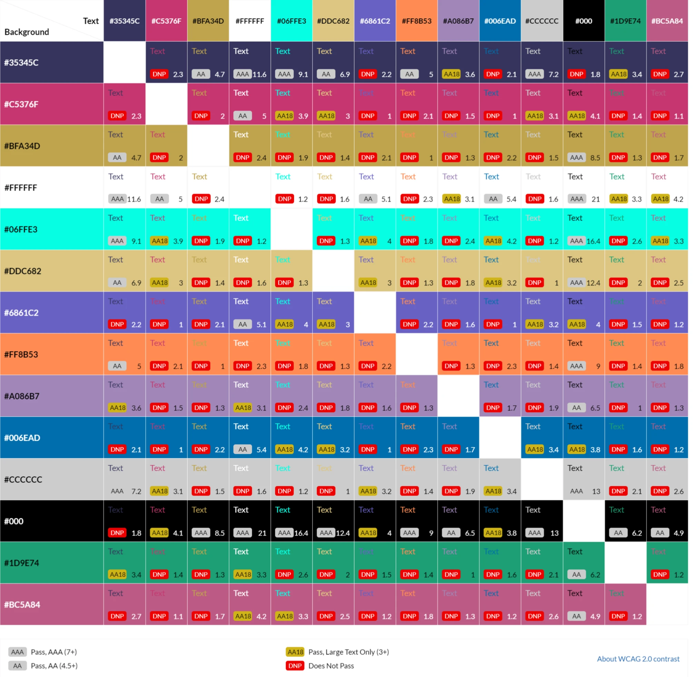

# **Yu-Gi-Oh guide for new/returning players**
## **Site Overview**
Kazuki Takahashi born on October 4th 1961 was a well known manga, author illustrator of the popular series Yu-Gi-Oh,  whom died in diving incident on the 4th of July 2022 saving a woman and her 11 year old daugther and Major Robert Borgeau who was as a diving instructor on the coast of Okinawa Island. Kazuki was who is known for creating the well known anime series of Yu-Gi-Oh (2000), Yu-Gi-Oh 5D's (2008) and Yu-Gi-Oh Zexel (2011) and  appeared as a regular feature in the magazine Shonen Jump in 1996. With the popularity of the series of teenage fans it inspired Kazuki to create the Official Card Game (OCG) which was first introduced in Japan and Trading Card Game (TCG) which was later introduced in the West, where it allowed players to duel with numerical valued ability cards against each other, following in the success of the hugely successful Pokémon TCG. 

## **Project Planning**
### **Target Audiences:**
* For users who are interested in learning how to play the Trading Card Game.
* For users who want to build their own perosnal play style and deck from scratch.
* For users who are returning/new players who have a general interest of the series and want to learn more about the game.
* For users who have never heard of YU-Gi-OH but are interested in the franchise.

### **Site Objectives:**
* Educating the user on how to play the game.
* Educating the user on how to construct their own deck/playinig style.
* Providing the user with external information to allow them to play and participate in local or online events.
* Promoting the popularity of Yu-Gi-Oh as a fan to encourage more people to play the franchise.
* Providing extra information on a extensive data base at which teh user can research at their own discretion.

### **User Stories:**
* As a user, I want to see information about the latest updates by Konami.
* As a user, I want to navigate the page with ease.
* As a user, I want to leave feeling as I know more about the Yu-Gi-Oh franchise.
* As a user, I want to be able to play and connect with other people around the globe through different social media platforms.
* As a user, I want to b able to play with different people through different means whether it is by a website, official franchise, games or in real life.

### **How will this be achieved:**
* The home page will allow the user a brief introduction as to what Yu-Gi-Oh is and a navigation point to different parts of the site.

* The site will provbide multiple links and resources such as:
    * The official website on Yu-Gi-Oh where it will show the latest updates and new decks that will be released by Konami.
    * Links to an extenseive database/deckbuilder where the user can create tehir ideal deck.
    * Embedded Youtube Videos showcasing tips and tricks.

* The site will provide different options on where to be involved with the Yu-Gi-Oh Community.
    * Through official Konami made apps where users can pit against each other virtually or in person.
    * Fan-made websites where the user can play virtual decks.

* The site will provide users a link on where to watch the series (providing they have an account linked via Crunchyroll or any affiliated anime streaming sites).

### **WireFrames:**
* To prevent any digression to the from the scope objectives, I have made wireframes for the project. Both the mobile and desktop version will have links to their respected versions of all six pages of the Yugioh guide:

    * Mobile Wireframes:
    * 
    * 
    * 
    * 
    * 
    * 

    * Desktop Wireframes:
    * 
    * 
    * 
    * 
    * 
    * 

### **Color Scheme:**
 * When creating the intial overall design of the site I have decided to use this colour scheme to go with the overall Yugioh to make it look more mysterious and within the color scheme of the cards from monster effects, to spells, traps and the newer cards which Konami have introduced, for example; XYZ , Synchro and Link monsters.

 