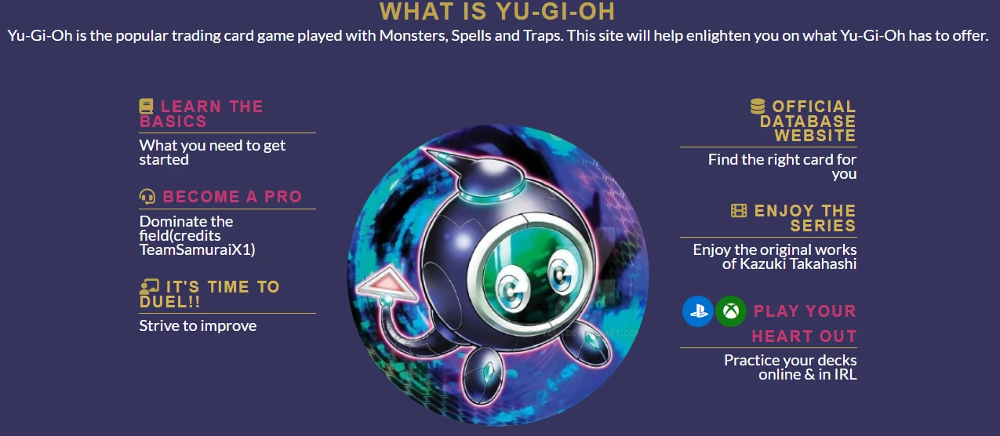
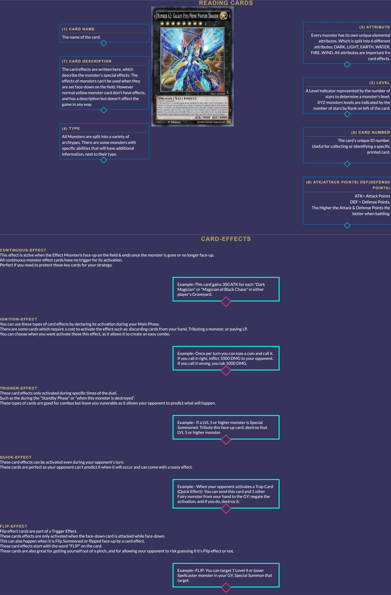

# **Yu-Gi-Oh guide for new/returning players**
## **Site Overview**
Kazuki Takahashi born on October 4th 1961 was a well known manga, author illustrator of the popular series Yu-Gi-Oh,  whom died in diving incident on the 4th of July 2022 saving a woman and her 11 year old daugther and Major Robert Borgeau who was as a diving instructor on the coast of Okinawa Island. Kazuki was who is known for creating the well known anime series of Yu-Gi-Oh (2000), Yu-Gi-Oh 5D's (2008) and Yu-Gi-Oh Zexel (2011) and  appeared as a regular feature in the magazine Shonen Jump in 1996. With the popularity of the series of teenage fans it inspired Kazuki to create the Official Card Game (OCG) which was first introduced in Japan and Trading Card Game (TCG) which was later introduced in the West, where it allowed players to duel with numerical valued ability cards against each other, following in the success of the hugely successful Pokémon TCG. 

### [Click here to view deployed site][Yu-Gi-Oh-Guide](https://leebri101.github.io/Yu-Gi-Oh-Guide/index.html)
1. [**Site Overview**](#site-overview)
1. [**Project-Planning**](#project-planning)
    * [**Target Audiences:**](#target-audiences)
    * [**User Stories**](#user-stories)
    * [**Site Objectives:**](#site-objectives)
    * [**How Is This Will Be Achieved:**](#how-will-this-be-achieved)
    * [**Wireframes**](#wireframes)
    * [**Color Scheme**](#color-scheme)
1. [**Current Features on all pages**](#current-features-on-all-pages)
    * [**Headers:**](#headers)
        * [*Title*](#title)
        * [*Logos*](#logos)
        * [*Navigation tabs*](#navigation-tabs)
    * [**Hero Images:**](#hero-images)
      * [**Home-Page**:](#home-page)
          * [*Hero-Image*](#hero-image)
      * [**Essentials-Page**:](#essentials-page)
          * [*Hero-Image*](#hero-image-1)
    * [**Anchor Tags Within the Pages Contents**](#anchor-tags-within-the-pages-contents)
    * [**Footer**](#footer)
    * [**Typsetting**](#typesetting)
1. [**Individual Page Contents features**](#individual-page-contents-features)
    * [**Home-Page Contents**](#home-page-contents)
    * [**Essentials-Page Contents**](#essentials-page-contents)
    * [**Cardinfo-Page Contents:**](#cardinfo-page-contents)
    * [**Decks-Page Contents:**](#decks-page-contents)
    * [**How-to-play-Page Contents:**](#how-to-play-page-contents)
    * [**Banlist-Page Contents:**](#banlist-page-contents)
1. [**Potential-Features**](#future-enhancements)
1. [**Testing Phase**](#testing-phase)
1. [**Deployment**](#deployment)
1. [**Credits**](#credits)
    * [**Honorable mentions**](#honorable-mentions)
    * [**General reference:**](#general-reference)
    * [**Content**](#content)
    * [**Media**](#media)

## **Project Planning**
### **Target Audiences:**
* For users who are interested in learning how to play the Trading Card Game.
* For users who want to build their own perosnal play style and deck from scratch.
* For users who are returning/new players who have a general interest of the series and want to learn more about the game.
* For users who have never heard of YU-Gi-OH but are interested in the franchise.

### **Site Objectives:**
* Educating the user on how to play the game.
* Educating the user on how to construct their own deck/playinig style.
* Providing the user with external information to allow them to play and participate in local or online events.
* Promoting the popularity of Yu-Gi-Oh as a fan to encourage more people to play the franchise.
* Providing extra information on a extensive data base at which teh user can research at their own discretion.

### **User Stories:**
* As a user, I want to see information about the latest updates by Konami.
* As a user, I want to navigate the page with ease.
* As a user, I want to leave feeling as I know more about the Yu-Gi-Oh franchise.
* As a user, I want to be able to play and connect with other people around the globe through different social media platforms.
* As a user, I want to b able to play with different people through different means whether it is by a website, official franchise, games or in real life.

### **How will this be achieved:**
* The home page will allow the user a brief introduction as to what Yu-Gi-Oh is and a navigation point to different parts of the site.

* The site will provbide multiple links and resources such as:
    * The official website on Yu-Gi-Oh where it will show the latest updates and new decks that will be released by Konami.
    * Links to an extenseive database/deckbuilder where the user can create tehir ideal deck.
    * Embedded Youtube Videos showcasing tips and tricks.

* The site will provide different options on where to be involved with the Yu-Gi-Oh Community.
    * Through official Konami made apps where users can pit against each other virtually or in person.
    * Fan-made websites where the user can play virtual decks.

* The site will provide users a link on where to watch the series (providing they have an account linked via Crunchyroll or any affiliated anime streaming sites).

### **WireFrames:**
* To prevent any digression to the from the scope objectives, I have made wireframes for the project. Both the mobile and desktop version will have links to their respected versions of all six pages of the Yugioh guide:

    * Mobile Wireframes:
    * [Home-page](doc/wireframes/home-page.png)
    * [Essentials](doc/wireframes/essentials.png)
    * [Card Info](doc/wireframes/card-info.png)
    * [Decks](doc/wireframes/decks.png)
    * [How To play](doc/wireframes/how-to-play.png)
    * [Banlist](doc/wireframes/banlist.png)

    * Desktop Wireframes:
    * [Home-page](doc/wireframes/about-page.png)
    * [Essentials](doc/wireframes/essentials-page.png)
    * [Card Info](doc/wireframes/card-info-page.png)
    * [Decks](doc/wireframes/decks-page.png)
    * [How To play](doc/wireframes/how-to-play-page.png)
    * [Banlist](doc/wireframes/banlist-page.png)

There was small changes from the planned wireframes to enhancve the UX (User Experience). Changess include:-

* Links on the homepage which direct teh user to differnt extrnal site e.g Youtube or the offcial Yu-Gi-OH site.
* Headings and placement of content to allow for a smoother flow and consistency across all pages.

### **Color Scheme:**
 * When creating the intial overall design of the site I have decided to use this colour scheme to go with the overall Yugioh to make it look more mysterious and within the color scheme of the cards from monster effects, to spells, traps and the newer cards which Konami have introduced, for example; XYZ , Synchro and Link monsters.

 

## **Current Features on all pages**
###  **Headers**
* All Headers have always been stuck to the top left of the pages or the center for mobile. The orginal plan was to use the headers as a way to naviagte back to the home-page but due to time constraints of the project being due very soon, it will be added at a later date a new feature.

* The headers contain all of the features

 The header itself contains the following features: 

### *Title:*

* The title is there to indicate the purpose of each page.

#### *Logos:*
* The logos illustrate the site's theme and offer something to appease the user's eye by filling the blank space without distracting from the title.

    * The logo on mobile version is to make sure that the title is enalarged on a smaller screen for a better user experience. 

        

    * Whereas the logo on the desktop version is to fill as much white space as possible on a higher screen resolution for a much cleaner appearence. 

        

#### *Navigation tabs:*
* all of the navigation tabs appear on all 6 pages of the site.
* Each of the pages links to the about page, essentials, card information, decks, how to play, and the current banlist allowing for easy navigation between the tabs.
* In the image below it shows that whenever a user is on the current page it is highlighted underneath a small purple line.
* Hovering over the menu will turn the highlighted word in a different color.

  

### **Hero Images**
* I have only added the hero image on the main home-page to act as the main attraction at which people would see once they open the link.
* The image has a zoom animation to attract the user to make it more presentable. 
* Each of the iamges used in this project is within them of Yugioh or explaining the functionality of the cards.

### **Home-Page**:
#### *Hero-Image:*
The picture used in as the hero image is none other than Linkuriboh, this cute round monster has appeared on the anime series of Yu-Gi-Oh Vrains which is the first to introduce Link summoning which is later introduced in the TCG game.

### **Essentials-Page**:
#### *Hero-Image:*
the picture used for the main banner for all of the pages is from a fan based site which produce incredible wallpapers for all Yu-Gi-Oh fans.

## **Anchor Tags Within the Pages Contents**
* All anchor tags that have been used in the page's contents do not have a under-lined hyperlink.
* Instead there is a color change upon hovering the links and also a color change upon visting the pages.
* The Hoevr over effect on all th ehyper links show a red color contrast from the original gold text to indicate the user about to select a different link.
* Have a hover-over effect that turns the Hyperlink a darker color from the gold gradient used throughout the page.
* At which i have created a seperate code in style.css to show that once the user has been to the site it will change from gold to red.

## **Footer**
* The footer has direct links to all of the offcial social media accounts of the Yu-Gi-oh franchise. Each of the icons are unique with their own colours for their own branding. 

* All the icons were imported from  the font awesome site using Javascript at the bottom of the page.

* In some of the footers on the rest of the pages I have included that a disclaimer that the site that is being built is merely a fan-based site at which it acts as a guide for returning or new players interested in the franchise and that all of the stated material goes to the rightful owners of the Yu-Gi-Oh franchise of STUDIO DICE/SHUEISHA, TV TOKYO, and KONAMI.

## **Typesetting**
 Throughput the project all of the fonts that were used were primarily 
  * Oswald - for an eyecatching look.
  * Space mono- for the retro gaming effect it has.

  * All Fonts that have been sued have been sourced from Google Fonts (as quoted in the credits)

## **Individual Page Contents features**

### **Home-Page Contents:**

* The main page gives a brief overview of what yugioh is. 
* The linked youtube video is showcasing tips and tricks on returning player son how to get better at the TCG game. 
* It also has its distinctive well-known gaming icons of both Sony and Microsoft.

### **Essentials-Page Contents:**

* This page gives you information at which the person needs certain resources if they choose to play th egame in real life.
* It also states the various different accessories which are available to enhance the users exeprience such as card sleeves for the added protection of the cards and the aesthetically pleasing artwork offered on said card sleeves or game mats.
* It also shows a diagram showing the different indicated numbers of the playing mat at which players have to set up their own decks.

### **Cardinfo-Page Contents:**

* This page explains on the basic structure of the card, consisting of the name, card description, the type, the attribute, level, the printed official card number, and its attack and defense points.
* below it explains the different card effects that cards have and how each one has its own use in any given situation.
 

### **Decks-Page Contents:**
* The Decks page offer fan favourites to the top tier meta cards at which many players use in various tournaments.
* Each of the cards are clickable and will send the user to an external site which will show the user of the full deck to build, if they choose to do so.

### **How-to-play-Page Contents:**
* This is a tutorial at which it showcases a step-by-step guide on howto play the game explaining the turn systems and how toplay various different cards.
* It also explains the different scenarios at which players can tactically play at their discretion and th evarious Spell and trap icons and meanings behind the cards.

### **Banlist-Page Contents:**
* This just shows a very static list of all of the upadated various cards that have been banned in any sort of offcial competition setting by Konami.
* My Original idea was to link each of the cards to the data-base of the offcial Yu-Gi-Oh site but it will be mentioned in the [Potential-Features](#potential-features). 

## **Potential-Features**
* Due to the personal busy schedule I have had many ideas at which i want to implement for this site were not added. But these are the ideas at whic i would like ti impliment in t henear future:
    * A scrollable gallery with the deck so that all the cards are not static
    * links to each individual card within the ban list table to allow for an easier naviagtion for the user.
    * An interactive animation at which it shows the user on how to play specfic cards. 

* Once I have better knowledge of learning Javascript later on the course i would like to add a drop down menu either on the side or the top of the page which allows for an accessible way of naviagting different tabs or different information. 

***
## **Testing-Phase**
I have added a Testing document which states the tests on the porject on pre-devlopment and post-development. [TESTING.md](TESTING.md)
***
## **Deployment**
The project has been deployed with the following steps: -

1. Within the project's [repository](https://github.com/leebri101/Yu-Gi-Oh-Guide), you then select the **Settings** tab.
2. Then select the **Pages** menue tab on the left side.
3. Under **Source** then, select the **Main** branch from the drop-down menu and click **Save**.
4. A message will then show that the porject has been successfully launched with the live link.
***

 ## **Credits**
### **Honorable mentions**
This project was a very fun and interesting way to showcase what i was capable of doing through my personal hobbies but i must credit the following people who have been supporting me throughout:
 * [Can Sucullu](https://github.com/cansucullu) - The Code Institute mentor who i may not have known for too long but has been a huge help to helping plan alot of the project and to pick out important stuff to include for th enear future (I will definitely be looking forward to our next meeting Can!)
* The Slack community of Code Institute for helping me find useful tips and tricks throught the course and project.
* My older brother for always giving me the best advice and always picking out the flaws in me to improve in any aspect (especially this project too).
* Huge Huge thanks to my girlfriend who is always supporting me and pushing me all the way love you.

### **General reference:**
* The project was inspired by the Code Institute's coding project called Love Running. i have tried to change as much as possible but there may be some similarties within the codes.
* I have also used W3Schools for useful tips on coding and the genereic basic coding in case i forgot.

### **Content:**
* All the content produced by me was all written by hand with the excemption of banlist.html as a majority of the data for the card names have been copied for accuracy. 
* Icons that were used throughout the project were taken from [Font-Awesome](https://fontawesome.com/)
* The golden gradient colour scheme - [brandgradients.com](http://www.brandgradients.com/gold-gradient).
* All fonts used have been imported from - [Google-Fonts](https://fonts.google.com/)

  
### **Media:**
* Yugioh database- [Yu-Gi-Oh Database](https://www.db.yugioh-card.com/yugiohdb/)

* Video on index.html has been taken from [TeamSamuraiX1's official YouTube channel](https://www.youtube.com/@TeamSamuraiX1)

* Dueling nexus to practice and play with differnt players- [Dueling Nexus](https://duelingnexus.com/register)

* To Watch all of the series- [Anime Planet](https://www.anime-planet.com/anime/all?name=Yugioh%21)

* Play the official game by Konami - [Master-Duel](https://www.konami.com/yugioh/masterduel/us/en/)

* Image within the home-page on index.html - [Linkuriboh](https://www.deviantart.com/ptcl4/art/Linkuriboh-Extended-Art-Playmat-854744127)

* Image within the essentials-page on essentials.html - [pendulum-mat](https://www.amazon.co.uk/Compatible-Competition-Pendulum-Yu-Gi-Oh-Mat/dp/B07Q25X2Y8)

* Image within the cardinfo-page on cardinfo.html - [number 62](https://www.deviantart.com/toailuong/art/Number-62-Galaxy-Eyes-Prime-Photon-Dragon-421408630)

* Image within the decks-page on decks.html - [Galacxy-eyes-photon-dragon](https://www.deviantart.com/kai1411/art/Galaxy-Eyes-Photon-Dragon-314212057)

* Image within the decks-page on decks.html - [eldlich-the-golden-lord](https://www.deviantart.com/alanmac95/art/Eldlich-the-Golden-Lord-827145842)

* Image within the decks-page on decks.html - [number_c62_neo_galaxy_eyes_prime_photon_dragon](https://www.deviantart.com/alanmac95/art/Number-C62-Neo-Galaxy-Eyes-Prime-Photon-Dragon-926009141)

* Image within the decks-page on decks.html - [ultimate-conductor-tyranno](https://www.deviantart.com/gena97/art/Ultimate-Conductor-Tyranno-945842596)

* Image within the decks-page on decks.html - [sky-triker-ace-kagari](https://www.deviantart.com/masaki2709/art/Sky-Striker-Ace-Kagari-834701563)

* Image within the decks-page on decks.html - [tri-brigade-shuraig-the-ominous-omen](https://www.deviantart.com/masaki2709/art/Tri-Brigade-Shuraig-the-Ominous-Omen-852305613)

* Image within the decks-page on decks.html - [divine_arsenal_aa_zeus___sky_thunder](https://www.deviantart.com/masaki2709/art/Divine-Arsenal-AA-ZEUS-Sky-Thunder-852305644)

* Image within the decks-page on decks.html - [kashtir-la-riseheart](https://yugioh.cardsrealm.com/en-ca/card/kashtira-riseheart)

* Image within the decks-page on decks.html - [infinitrack-megaclops](https://www.deviantart.com/masaki2709/art/Infinitrack-Fortress-Megaclops-787061190)
 
* Image within the decks-page on decks.html - [blue-eyes-chaos-max-dragon](https://www.deviantart.com/alanmac95/art/Blue-Eyes-Chaos-MAX-Dragon-603296433)

* Image within the play-page on play.html[hunter-dragon](https://yugipedia.com/wiki/Hunter_Dragon)

* Image within the play-page on play.html[set-card](https://yugioh.fandom.com/wiki/Set)

* Image within the play-page on play.html[blue-eyes-alternative-white-dragon](https://unicorncards.co.uk/lds2-en008-p-blue-eyes-alternative-white-dragon-purple-ultra-rare-1st-edition-mint-yugioh-card)

* Image within the play-page on play.html[dark-magician](https://www.deviantart.com/blader999/art/Dark-Magician-623457790)

* Image within the play-page on play.html[luster-dragon](https://www.deviantart.com/wiccalock8/art/Luster-Dragon-2-941062810)

* Image within the play-page on play.html[seleglare](https://www.deviantart.com/masaki2709/art/Seleglare-the-Luminous-Lunar-Dragon-851591460)

* Image within the play-page on play.html[field-barrier](https://www.deviantart.com/masaki2709/art/Field-Barrier-848613705)

* Image within the play-page on play.html[anti-spell-fragrance](https://www.deviantart.com/masaki2709/art/Anti-Spell-Fragrance-771072356)

* Image within the play-page on play.html[parasomnia-pillow](https://www.deviantart.com/alanmac95/art/Dream-Pillow-Parasomnia-903699793)

* Image within the play-page on play.html[twin-twisters](https://www.deviantart.com/masaki2709/art/Twin-Twisters-761385449)

* Image within the play-page on play.html[field-spell](https://www.deviantart.com/gena97/art/Skyscraper-807067811)

* Image within the play-page on play.html[counter-trap-card](https://www.deviantart.com/masaki2709/art/Solemn-Judgment-756863469)

* banner image on index.html - [Yugioh wallpaper](https://wallpaper-house.com/group/yugioh-background/index.php)

* Image compressions- [TinyPNG](https://tinypng.com/) 

* watermark remover-[watermarkremover.io](https://www.watermarkremover.io/)

* Colored grid scheme - [EightShapes](https://contrast-grid.eightshapes.com/) 

