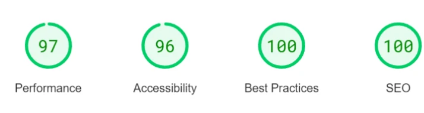
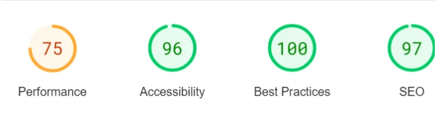
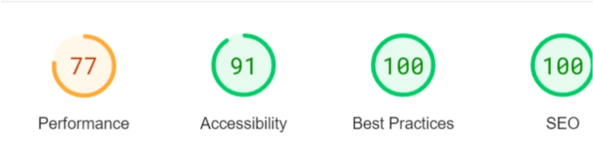
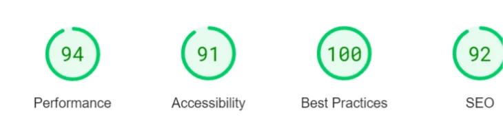
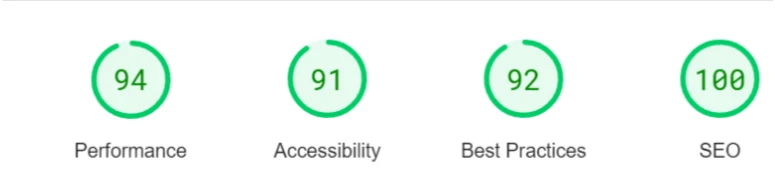
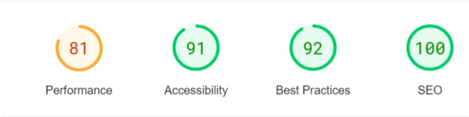
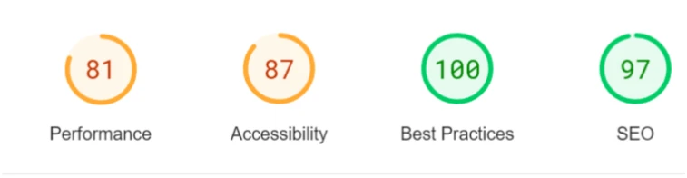

# Testing Page of Contents
* [**Development Testing Phase**](#development-testing-phase)
    * [**Manual Testing Phase**](#manual-testing-phase)
    * [**Bugs and Fixes**](#bugs-and-fixes)
* [**Post Development Testing-Phase**](#post-development-testing-phase)
  * [**Validator Testing**](#validator-testing)
    * [**HTML**](#html---httpsvalidatorw3orgnu)
    * [**CSS**](#css---httpsjigsaww3orgcss-validator)
  * [**Lighthouse Scoring**](#lighthouse-scoring)

## **Development Testing Phase**
In the development phase, I was manually testing the site in two ways:-
    
1. Publishing the page via GitHub and sharing it with friends and family to test within a set controlled environment, and receive feedback on major and small changes that needed to be rectified.

1. Self testing to ensure that "I" as the creator know what to expect of the site.

### **Manual Testing Phase**
* During the testing phase , I used three different browsers to ensure consistency & cross-platform connectivity. The browsers used in the tests are:

  1. Chrome
  2. Firefox   
  3. Edge

* I also used devtools to experiment the different screen sizes and devices from 450px up to 4000px in width. 
* I have also asked a small group of people to test the site using Apple & Android products using safari. The users reported back with no issues with overall content but with minor styling amendmants or styling suggestions which will be implimented in the near future with further testing.

### **Bugs and Fixes**

* Below is the list of bugs and solutions used during the development & testing phase of the project.

1. **Outcome** - Correct sizing of playing mats to fit to all versions of the pages on different devices and removal of disorientated images by using width: 100%;.
    * **Issue Found:**
        * Playing mats on both the tutorial not resizing itself due to the image itself.
    * **Solution:**
        * Changed the original image to smaller set of dimensions and used the code width: 100% to keep the image within the site widths so there is no visable horizontal scroll.

1. **Outcome** - Adjusted all the cards width: 100%; to fit into one page and not stretch out.
    * **Issue Found:**
        * Yugioh card sizing issues on mobile pages
    * **Solution:**
        * Scaling down the size of the cards to a width of 100% so the image is not distorted and not blurred. 

1. **Outcome** - Cleaner look of the banlist with no gaps 
    * **Issue Found:**
        * Bordering issues on the banlist as it caused a large gap in the mobile site. 
    * **Solution:**
        * Fixed bordering issue on banlist by reducing the font size by percentage from 80% to 75% with width of 100%.

## **Post Development Testing Phase**
### **Validator Testing**

#### **HTML** - https://validator.w3.org/nu/

* All pages have been fully tested no issues were found via URL or file upload.

#### **CSS** - https://jigsaw.w3.org/css-validator/

* CSS page has been tested, no issues found via URL or file upload.\

### **Lighthouse Scoring**

### **Testing Conditions:**
* I have git sran the tests for mobile and desktop. 
* I have asked a small group of people to run lighthouse tests from their own devices. 

#### **Desktop Version:**
I have only included a screenshot for desktop as all pages were the same score, only changing by one or two points in performance if I ran it multiple times. 

 

**Maintaining the score:**
1. All of the html files were at above 97% or more within the desktop version with only small minor coding issues which dropped the performance to around 87% on the banlist due to it being a list, but overall the desktop version is fully fucntional and working.

#### **Mobile Version:**
* Due the significant reduction on screen resolution the overall lighthouse ratings will drop due to the overall screen size however most of the results where above 90% whereas the perfomance was most at a high 81%.

* A majority of the images used in the project are either JPEGs or PNGs which meant that it affected the performance on mobile but not on desktop, compressing the images help increase the perfomance score.

* Due to the large size of the images it hindered the performance and mostly dropped to around 71%, but compressing all of the images on https://tinypng.com/ had helped raised the performce to within +80% on the mobile version.

* The mobile tests of intial SEO was at around 75-85% from not adding the Meta description. Upon adding, it increased the score between both 97 or 100.

  
1. ***index.html:***

 * The orignal score for the performance of the page was 71%. But with compressions of the images on the page and editiing of the logo and overall text it only managed tp raise it to 75%. As a lesson for next time is to adjust the headings to an appropriate sizing for the user and for various different devices.

 2. ***essentials.html:***

 * With the changes of the headings and fonts it was still difficult to raise the performance of the page from 75 to at least +90% but, but for a future reference for the next project it will be more spacious and readable via the mobile version by adding shapes or reducing the wording to a certain length.

 3. ***cardinfo.html:***

* Overall a good set of ratings as most of the layout was configured to a more mobile friendly look, but this will need to be consistent overall for any next projects that I create. 

4. ***decks.html:***

* A simple linear gallery at which it links in with an extrenal site from card to deck which as most of the cards are consistently within the same height and width.

5. ***play.html:***

* A simple static page but with a nice layout for the turns, but it raised the performance from 75% to 81% with rending of all the yugioh cards on the page and with adjustments to the text sizing and also the colour scheme of the text to make it more user friendly. 

6. ***banlist.html:***

 

* As this last page was to be a simple table of theme of each of the cards listed in the 2023 banlist it had two amber ratings of both performance and accessibility. Performance due to one of the most common flagged issue was "Serve static assets with an efficient cache policy" at which even compressing the imnage it still flagged up. As a lesson to learn next time to either use a WEBP or AVIF format to reduce loading times and space of images.

[Go back to README.md](README.md)